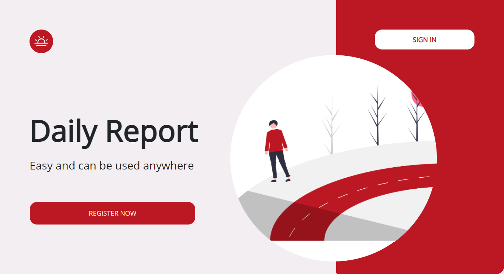

<h1 align='center'>Employees Membership Daily Report</h1>
  <p align="center">
    <a href="https://github.com/arsasf/daily_reports_frontend/issues">Report Bug</a>
    ·
    <a href="https://github.com/arsasf/daily_reports_frontend/pulls">Request Feature</a>
  </p>



## About The Project

Employees Membership Daily Report a website that displays daily reports of employee membership status across decades.

## Built With

[](https://github.com/facebook/react)
[](https://github.com/react-bootstrap/react-bootstrap)

## Requirements

1. <a href="https://reactjs.org/">React Js</a>
2. Node_modules `npm install` or `yarn install`
3. Backend RESTFull API [`here`](https://github.com/arsasf/daily_reports_backend.git)

## Getting Started

1. Download this Project or you can type `git clone https://github.com/arsasf/daily_reports_frontend.git`
2. Open app's directory in CMD or Terminal
3. Type `npm install` or `yarn install`
4. Type `npm start` to running project

```sh
API_BASE_URL: http://localhost:3010/api/v1/
API_IMG_URL: http://localhost:3010/api/
```

## Feature

Employee

1. CRUD Profile
2. Upload Profile Image
3. Change Password
4. Register & Login
5. View Chart
6. View & Filter Daily Report
7. Viem other employees

Manager

1. CRUD Profile
2. Upload Profile Image
3. Change Password
4. Register & Login
5. View Chart
6. View & Filter Daily Report
7. Viem other employees
8. CRUD Membership Daily Report

## Acknowledgements

- [Axios](https://www.npmjs.com/package/axios)
- [React](https://reactjs.org/)
- [React Bootstrap](https://react-bootstrap.github.io/)
- [ENV](https://www.npmjs.com/package/dotenv)
- [Redux](https://github.com/reduxjs/react-redux)
- [Chart](https://www.npmjs.com/package/chart.js?activeTab=readme)

## License

© [Aulia Safitri](https://github.com/arsasf/)
